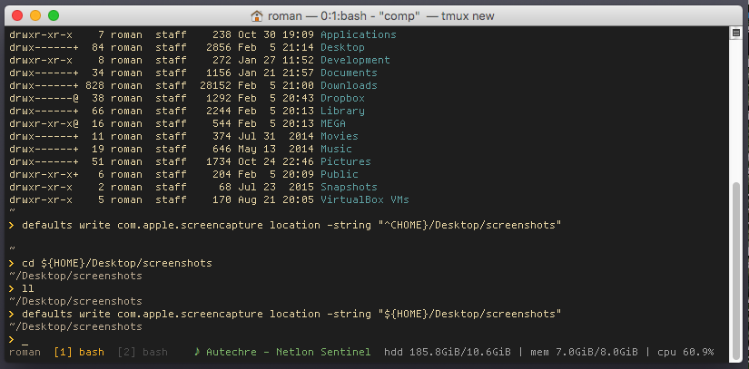

### - dotfiles
yo! It is *roman* dotfiles


### - requirements

1. Ruby, Python
2. [psutil](https://github.com/giampaolo/psutil)
3. [reattach-to-user-namespace](https://github.com/ChrisJohnsen/tmux-MacOSX-pasteboard) *for pasteboard sharing between tmux and OS X*

### - installation

```bash
  > git clone https://github.com/emmit8/dotfiles.git
  > cd dotfiles && ./bin/install_dotes.rb 
```

### - etc
```bash
# Brew
> /usr/bin/ruby -e "$(curl -fsSL https://raw.githubusercontent.com/Homebrew/install/master/install)"
# Tmux 
> brew install tmux
# Vim plug
> curl -fLo ~/.vim/autoload/plug.vim --create-dirs \
    https://raw.githubusercontent.com/junegunn/vim-plug/master/plug.vim
```

